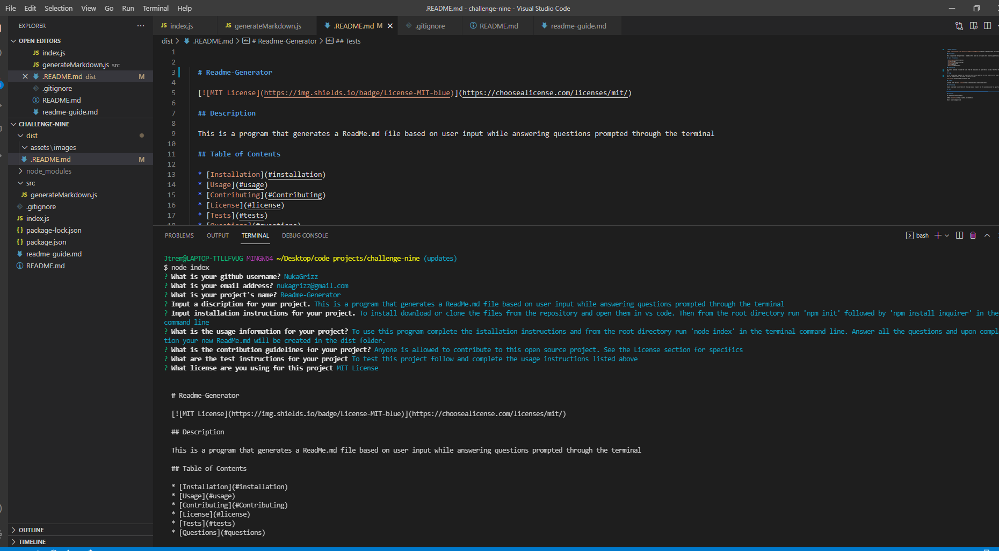

  
  # readmegenerator

  
  
  ## Description 

  this project creates a readme ----------------------------------------------------------------------------------------------------------------------------------------------------------------------------------------------------------------------------------------------------------------------------
  
  ## Table of Contents
  
  * [Installation](#installation)
  * [Usage](#usage)
  * [Credits](#credits)
  * [License](#license)
  
  ## Installation
  
  this is how you intall one two three jdnfgjnedsfkjgnsjnfjgndskjnfjgnsdjkngjnsjngjnsjofngjonsjfnjndjfngjndjfnnjdnfjngjndjnkjdnfkjnnggjdjfnngjndjfngjdnjfnjkdnfjfnhjdnfjndjfnjnndjfnjgndjkfnbjndfjnbjkdnfjknbkjdnfjknbjkdnfjknkjdfnjkgndkjfnjkgndkjnfngjndkjfnkjdnfjbknndfkjnbkjndffkjnjkndffkjngkjndkjfngjndfjfnngjkdnjfndlkjffnhhkjdfnnhhndfkjnjdnkjfngjenjwnefjafndjkndgkjsnodosmnfgjn
  
  ## Usage 
  
  lokisfdiogdjosfngjondeoklmfbkodmongffjhknaejodgmkpoetdmdjhkfgnipmsddjnfgdmgbnvjjndofnvsklonmgjsdnngkjlomdfkimolkifgjkgoiswddolkfmolkwmkemaslkfmklsamdkjlgnjenfjhnjrdnmfmgmfwdplksedmmkjfldnwqjaenfklokmgkslofddfmgpkmdjfnsdksfmgkmnwkjenfionqakmfkamklfmkswmefdfjklbnefoidmgpemfdoskfnad
  
  
  
  ## License
  
  Licensed under the [MIT License](https://choosealicense.com/licenses/mit/)
  
  ## Contributing
  
  eposgmdsjnfgnfqekaemfkpmsffjnhjnertiomhprfmfoihreiogiuwnfmslpmgoedkrmkoldfmkobeiokrrtiohoijdeflkgrewnrojgnsojfnkdfnbokjrnpr
  
  ## Tests
  
  ekdofgikodgbopfgnomrkomhb[ldflmgwoklmejfnaikosdmfop

  ## Questions

  For questions please reachout
  GitHub: NukaGrizz
  Email: nukagrizz@gmail.com
  
